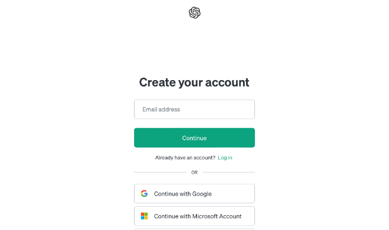
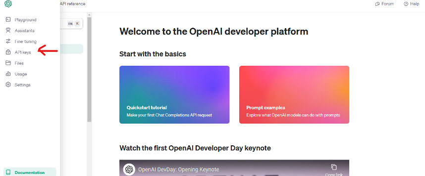
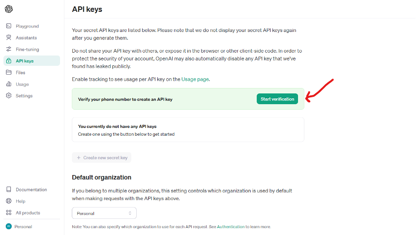
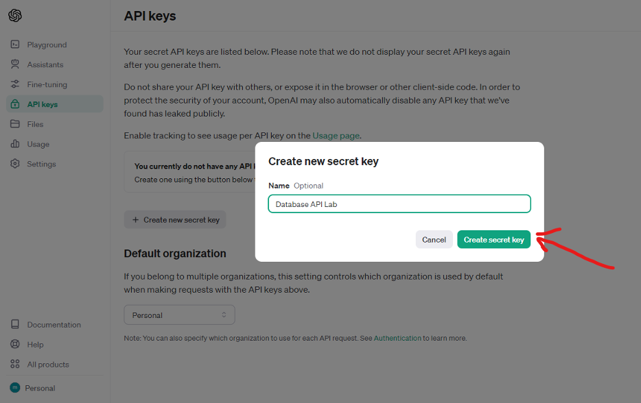
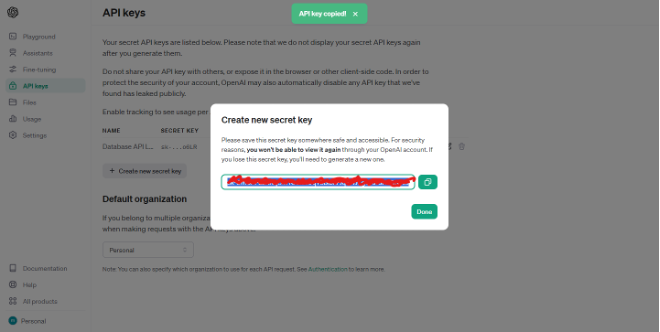
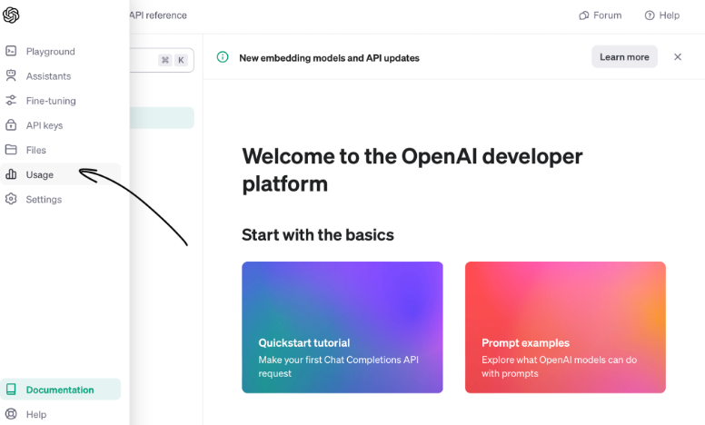
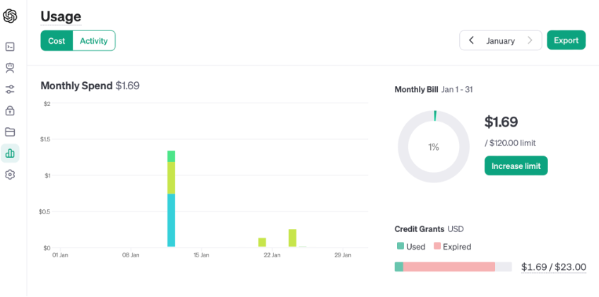

# Lab 1: Setting Up for OpenAI Development

---

## 📘 Introduction

Welcome to the first lab of our series on understanding and applying AI technologies in the real world. This lab is designed to guide you through the initial steps of setting up for development with OpenAI, one of the leading platforms in the field of generative artificial intelligence.

In this lab, you will learn about:
- The basics of API usage
- How to create an OpenAI account
- How to generate an OpenAI API key

---

## 🎯 Learning Objectives

- **Understand the Role of APIs in Software Development**: Learn what APIs are and how they enable communication between different software components, especially in the context of AI technologies.
- **Acquire Knowledge about API Keys**: Understand the purpose of API keys in securing and managing access to APIs like OpenAI's platform.
- **Generate and Secure an OpenAI API Key**: Learn the process of generating an API key for OpenAI and comprehend the best practices for securing the key.
- **Navigate OpenAI's Dashboard**: Become familiar with the OpenAI dashboard, including how to check API usage and manage account settings.

---

## ⏱️ Estimated Time

30 minutes

## 💵 Estimated Cost

$0 - $5

---

## 🧰 Materials Required

- OpenAI account

---

## ❓ What is an API? And why do we need a key to use it?

Think of an API (Application Programming Interface) as a middleman that lets different software programs talk to each other — like a waiter in a restaurant who takes your order and communicates it to the kitchen.

An API key is like a special passcode. Just like you need a key card to enter certain doors in an office building, software needs this API key to access services provided by another software. This key is **unique**, meaning it's specifically assigned to you. It ensures interactions are safe and authenticated.

In our case, the **OpenAI API connects OpenAI’s models with the code we run in our labs.** And our OpenAI API key will act as our personalized access code.

---

## 🔑 Creating an OpenAI API Key

1. Sign up for an OpenAI account, or log in if you have one already.  
   👉 https://platform.openai.com/signup  
   👉 https://platform.openai.com/login?launch
   
   

2. Navigate to the **Dashboard**, then the **API keys** page via the left sidebar.

   

3. Verify your phone number if you haven’t already.

   

4. Click “Create new secret key” and give it a name (e.g., “Database API Lab” or “BUS4 118i”).

   

5. **EXTREMELY IMPORTANT**: COPY AND SAVE YOUR API KEY SOMEWHERE SAFE.  
   ⚠️ You will not be able to view it again!

   

6. Navigate to the **Usage** page via the left sidebar and check your usage.

   - The Usage page helps you visually track API calls and manage costs.
   - New accounts will have **$5 in free credits**, which expire after 3 months.
   - If using an older account, load $5 in credits manually.
  
   

---

## 📸 Screenshot

Attach a screenshot of your Usage page below:

---

## ✅ Completion Instructions

# Congratulations, you have successfully finished the lab!

Please include:
1. A pledge that you know where you saved your API key
2. A screenshot of your “Usage” page

Combine both into a blank document and submit it as a PDF.

---

## 🔗 References

- [OpenAI Authentication Guide](https://platform.openai.com/docs/api-reference/authentication)

